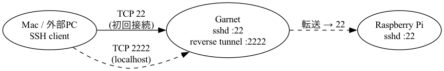
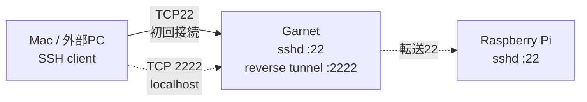
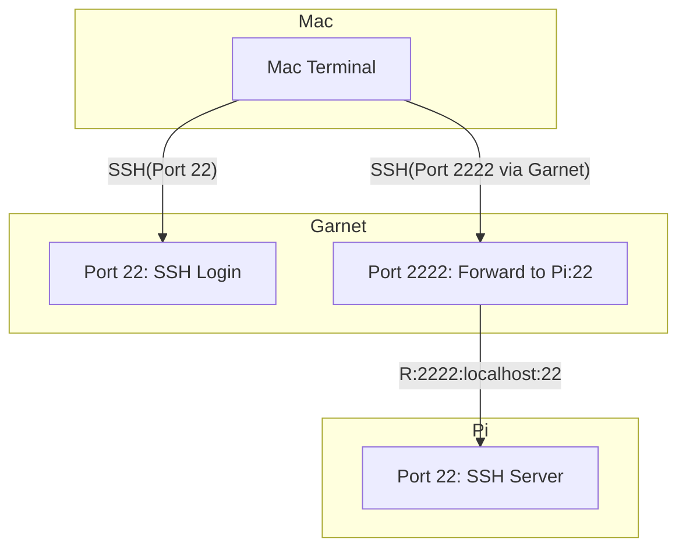
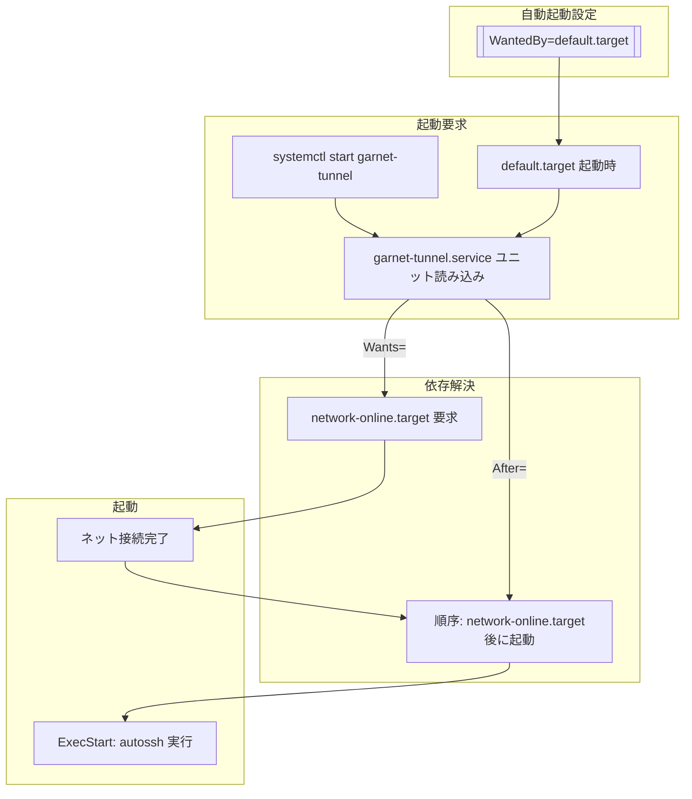
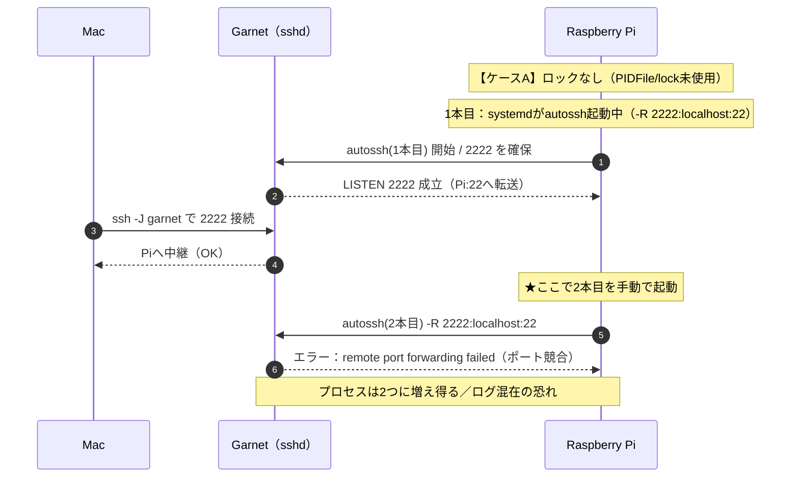
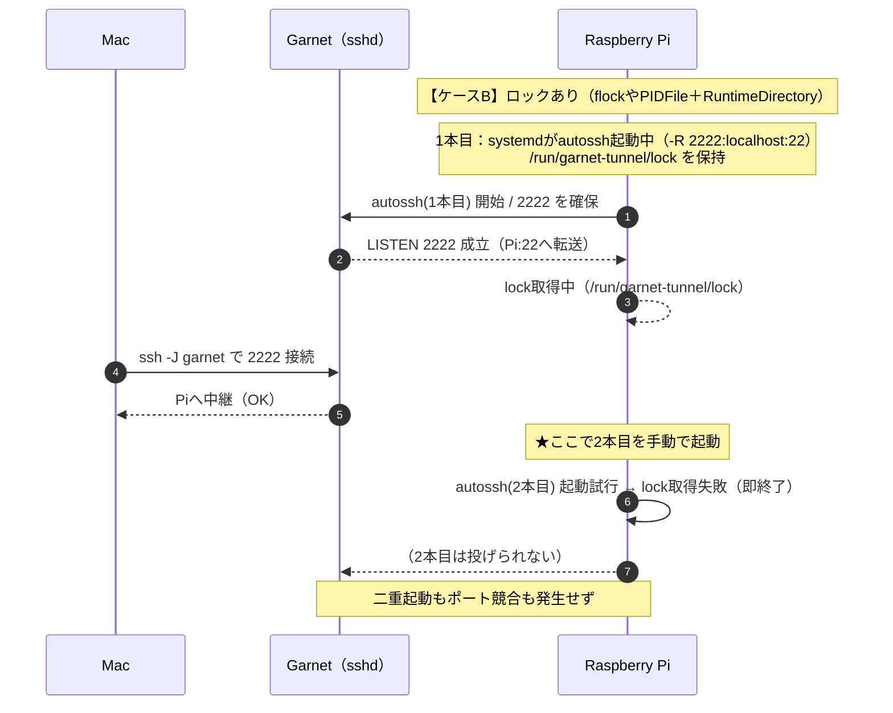

## リモートポート転送構成図（Graphviz 版）

---

## リモートポート転送構成図（Mermaid 版）

```mermaid
flowchart LR
    Mac["Mac / 外部PC
    SSH client"]
    Garnet["Garnet
    sshd :22
    reverse tunnel :2222"]
    Pi["Raspberry Pi
    sshd :22"]
Mac -->|TCP22
初回接続| Garnet
Mac -.->|TCP 2222
localhost|Garnet
Garnet -.->|転送22| Pi
```

```mermaid
flowchart
    subgraph Mac
        M[Mac Terminal]
    end

    subgraph Garnet
        G22[Port 22: SSH Login]
        G2222[Port 2222: Forward to Pi:22]
    end

    subgraph Pi
        P22[Port 22: SSH Server]
    end

    %% 通常SSH接続
    M -- SSH(Port 22) --> G22

    %% リモートポート転送
    G2222 --R:2222:localhost:22--> P22

    %% MacからPiへ
    M -- SSH(Port 2222 via Garnet) --> G2222
```

```mermaid
flowchart TD
    subgraph 起動要求
        A[systemctl start garnet-tunnel] --> B[garnet-tunnel.service ユニット読み込み]
        C[default.target 起動時] --> B
    end

    subgraph 依存解決
        B -->|Wants=| D[network-online.target 要求]
        B -->|After=| E[順序: network-online.target後に起動]
    end

    subgraph 起動
        D --> F[ネット接続完了]
        F --> E
        E --> G[ExecStart: autossh 実行]
    end

    subgraph 自動起動設定
        H[[WantedBy=default.target]] --> C
    end
```

```mermaid
sequenceDiagram
    autonumber
    participant Mac as Mac
    participant Garnet as Garnet（sshd）
    participant Pi as Raspberry Pi

    Note over Pi: 【ケースA】ロックなし（PIDFile/lock未使用）
    Note over Pi: 1本目：systemdがautossh起動中（-R 2222:localhost:22）

    Pi->>Garnet: autossh(1本目) 開始 / 2222 を確保
    Garnet-->>Pi: LISTEN 2222 成立（Pi:22へ転送）

    Mac->>Garnet: ssh -J garnet で 2222 接続
    Garnet-->>Mac: Piへ中継（OK）

    Note over Pi: ★ここで2本目を手動で起動
    Pi->>Garnet: autossh(2本目) -R 2222:localhost:22
    Garnet-->>Pi: エラー：remote port forwarding failed（ポート競合）
    Note over Pi,Garnet: プロセスは2つに増え得る／ログ混在の恐れ

```

```mermaid
sequenceDiagram
    autonumber
    participant Mac as Mac
    participant Garnet as Garnet（sshd）
    participant Pi as Raspberry Pi

    Note over Pi: 【ケースB】ロックあり（flockやPIDFile＋RuntimeDirectory）
    Note over Pi: 1本目：systemdがautossh起動中（-R 2222:localhost:22）<br/>/run/garnet-tunnel/lock を保持

    Pi->>Garnet: autossh(1本目) 開始 / 2222 を確保
    Garnet-->>Pi: LISTEN 2222 成立（Pi:22へ転送）
    Pi-->>Pi: lock取得中（/run/garnet-tunnel/lock）

    Mac->>Garnet: ssh -J garnet で 2222 接続
    Garnet-->>Mac: Piへ中継（OK）

    Note over Pi: ★ここで2本目を手動で起動
    Pi->>Pi: autossh(2本目) 起動試行 → lock取得失敗（即終了）
    Pi-->>Garnet: （2本目は投げられない）
    Note over Pi,Garnet: 二重起動もポート競合も発生せず

```